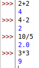
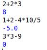
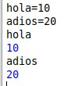
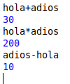
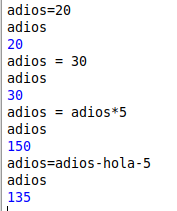

# Capítulo 2

## La Consola Interactiva

* **Intalación de idle**
  * Abrir Terminal y poner "sudo apt install idle3"
  * Poner el siguiente comando "idle"
* **Utilización de la consola interactiva**
  * Operaciones básicas
    * Suma "+"
    * Resta "-"
    * Multiplicación "*"
    * División "/"
    * 
  * Operaciones compuestas
    * Se tratan de operanciones con más de un operando
    * 
  * Operaciones con variables
    * Tratan de asociar números a variables
    * 
    * Operaciones
    * 
    * Cambiar el valor de una variable
    * 