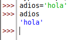
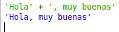
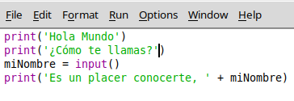
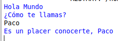
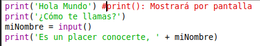

# Capítulo 3

## Escribiendo Programas

* **Utilización de la consola interactiva**
  * **Cadenas básicas**
    * 
  * **Concatenación de cadenas**
    * 
  * **Escribir programas**
    * Para ello deberemos dar el primer paso de darle a file, new file y guardarlo con el nombre que quieras pero con la extensión .py
    * Después usaremos el siguiente codigo.
    * 
      * Explicación breve:
        * print(): Mostrará por pantalla lo que se le indique dentro de los paréntesis entre comillas.
        * miNombre: Es el nombre que le hemos dado a la variable, tenemos la opción de darle valor directamente o de darselo mediante un input() lo que significa que le daremos el valor mientras que ejecutamos el programa.
      * Para ejecutar el programa deberemos darle a Run -> Run Module y este sería el resultado.
      * 
    * Para comentarios bastará con iniciar la línea con un "#" y todo lo que se ponga después se tomará como un comentario. 
    * 