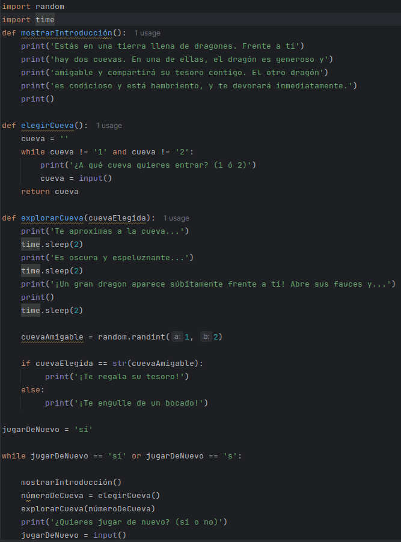

# Capítulo 6

## Reino de los dragones

* Código del juego del reino de los dragones
* 

Explicación del código desde arriba hacia abajo
* import random, lo usaremos para poner un número aleatorio más tarde
* import time, lo usaremos para indicar una cantidad de tiempo
* def: Los usamos para indicarle que vamos a definir una nuevo función
* Primer bucle:
  * Iniciamos cueva para que esté vacío
  * Indicamos que el usuario introduzca el número de la cueva 1 o 2
* Otra función para sacar un texto predefinido dando igual cuál de las dos cuevas se elija
* time.sleep, antes pusimos import time para ahora usarlo para indicarle una cantidad de tiempo, la cual se la indicaremos un la palabra reservada sleep(2), el número que le indiquemos entre paréntesis será el número de segundo que se ejecutará el parón
* Hacemos la variable cuevaAmigable, si dentro de los dos números posibles elegimos el 1 iremos al primer print, sin embargo si usamos el segundo iremos al segundo print
* Cuando acabe el juego iniciaremos otro bucle en el que le indicaremos que si ponemos "sí" o "s" el juego se iniciará de vuelto, si no este se terminará.