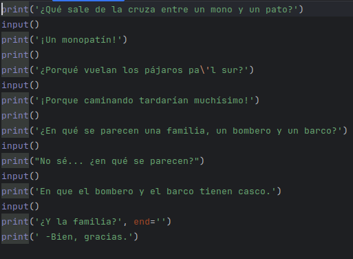

# Capítulo 5

## Chistes

* Uso exhaustivo del print()
* 

Esto de aquí es un gran uso del print que a continuación ire explicando poco a poco las cosas nuevas como ese " \\' " o ese "end"

* Hay cosas que no se pueden mostrar de forma directa así que tendremos que indicárselo de otra manera, aquí van algunos ejemplos de esto:
  * \\\ Pondremos 2 barras inversas para que pueda salir 1: \\
  *  \' Para mostrar la comilla simple deberemos de poner barra inversa comilla: \\'
  *  \" Igual que para la comilla doble, deberemos poner barra inversa y comilla doble \\"
  *  Para generar un salto de línea deberemos poner lo siguiente: \n
  *  Para hacer una tabulación deberemos poner lo siguiente \t
* Otra cosa a tener en cuenta es que por defecto print te imprime por pantalla lo que le indiques y generará un salto de línea automáticamente.
  * Para que esto no ocurra deberemos usar "end", esto le indicará al print una caden de texto vacía por lo que no hará un salto de línea, y pondrá el siguiente print en esta.
