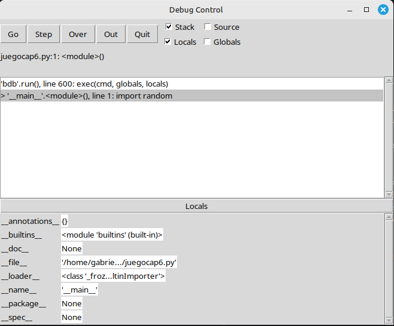
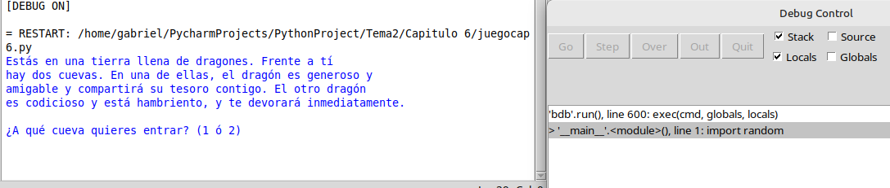
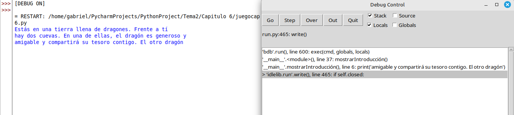
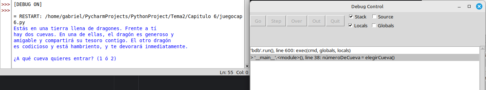
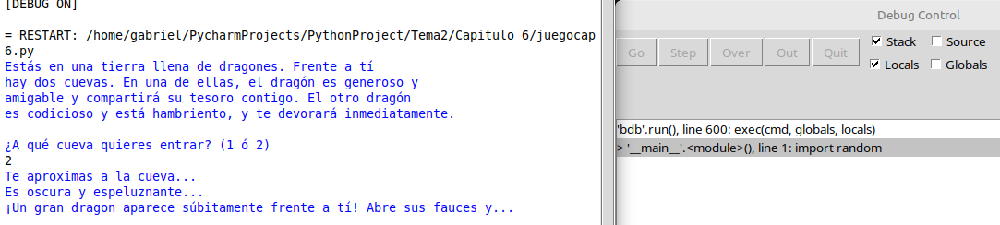
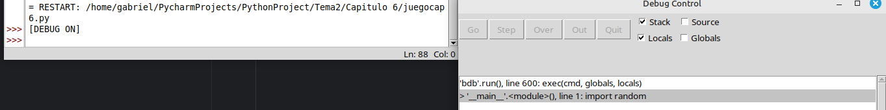

# Capítulo 7

## Usando el depurador

* **Iniciar el depurador**
  * **Pulsar en Run -> Debug**
* **Iniciar depurador en Idle**
  * **Abrir el programa, pulsar en Debug -> Debugger**
  * **Ya tendremos que darle a ejecutar de nuevo el programa (f5)**
    * 
  * **Ya tendremos distintos botones**
      * Explicación breve:
      *       Go: Correrá el programa con normalidad.
    * 
      *       Step: Cada vez que le des se ejecutará un paso del programa.
    * 
      *       Over: Para no perder tiempo con el botón de Step, le daremos a este para ir directamente a la función de print.
    * 
      *       Out: Pulsar para saltar todas las líneas necesarias para saltar la función.
    * 
      *       Quit: Pulsar para terminar el programa.
    * 